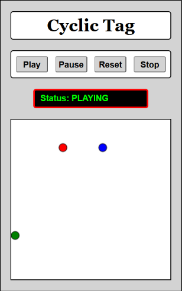

# Cyclic Tag

A real-time pursuit-evasion game built on top of the [Game GUI Framework](https://github.com/avikpln/game-gui-framework), where you control one of three players locked in a closed chase: each player simultaneously hunts one opponent while fleeing another.

🎮 **[Play it live](https://avikpln.github.io/cyclic-tag/)**



---

## The Game

Three players are arranged in a cycle: you (blue) chase green, green chases red, and red chases you. Use the arrow keys to control blue.

The game ends the instant any player catches its target. Whoever catches their target wins; whoever gets caught loses; the third player — who didn't catch anyone — also comes away without a win. From your seat as blue:

- **You win** — you catch green.
- **You lose** — red catches you.
- **You neither win nor lose** — green catches red before you catch green; the round ends with neither outcome touching you directly.

Green and red are computer-controlled, each following a simple pursuit/evasion heuristic: move toward its target, away from its predator.

---

## Tech Stack

- **JavaScript** — game logic and AI movement, built on the [Game GUI Framework](https://github.com/avikpln/game-gui-framework)
- **HTML / CSS** — UI and layout

---

## Running Locally

```bash
git clone https://github.com/avikpln/cyclic-tag.git
cd cyclic-tag
open index.html   # or drag into your browser
```

---

## Project Structure

```
cyclic-tag/
├── script/       # Game logic, pursuit/evasion AI, rendering
├── css/          # Styling and layout
├── images/       # Game assets and screenshot
├── audio/        # Sound effects
└── index.html    # Entry point
```
